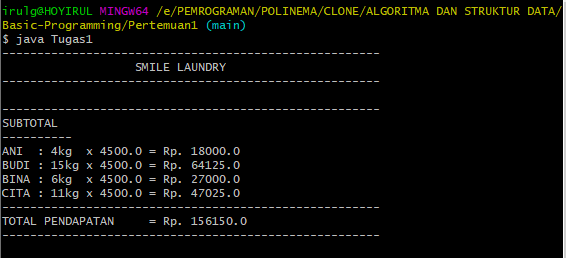

# Laporan tugas algo

## pertanyaan 2.1
1. bla bla bla
2. bla bla bla
    * ini a
    * ini b 

## 2.2
1. bla bla bla
2. bla bla bla

## 2.3
1. bla bla bla
2. bla bla bla

## Tugas praktikum
1. Screenshot code
    * png/jpeg/jpg/svg/gif
    * 
   Screeshot output
    * 
2. Screenshot code
    * png/jpeg/jpg/svg/gif
    * 
   Screeshot output
    * 
3. Screenshot code
    * png/jpeg/jpg/svg/gif
    * 
   Screeshot output
    * 
4. Screenshot code
    * png/jpeg/jpg/svg/gif
    * 
   Screeshot output
    * 
